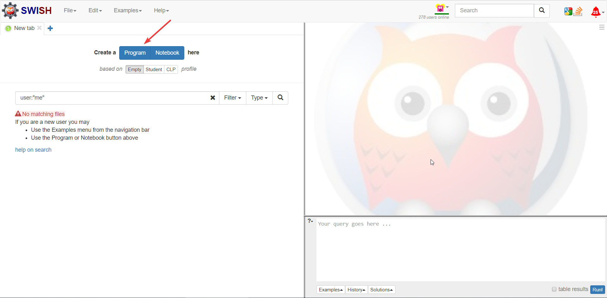
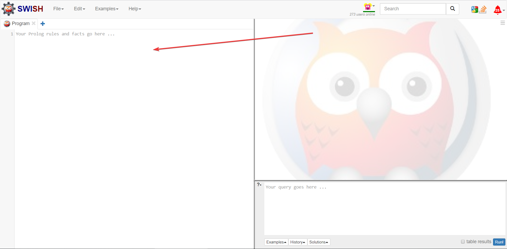
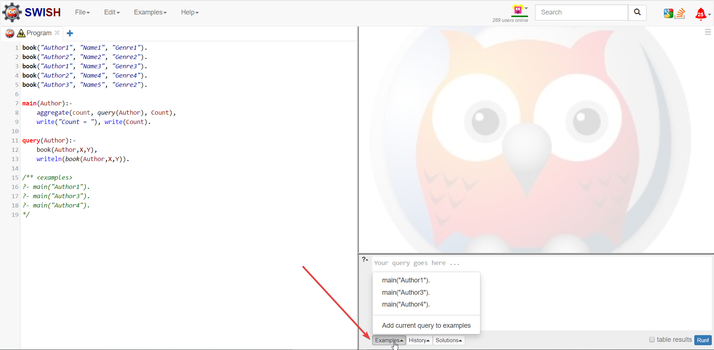
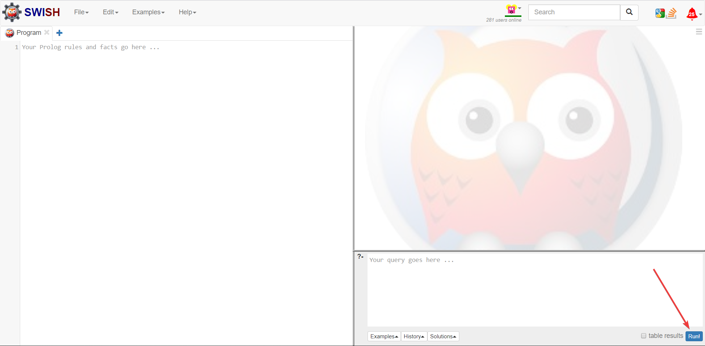

# How to run online?
## 1) [Open link](https://swish.swi-prolog.org/)
## 2) Push the 'Program' button or skip this step

## 3) Copy and paste the code on the left.

## 4) Select one of Examples or write a custom query.

## 5) Press the run button.
