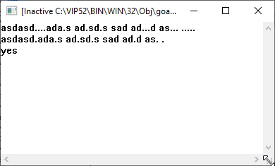
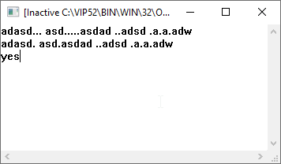
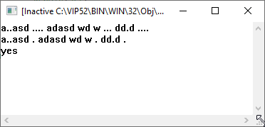

# Description
## Варіант 17
### 1) Ввести рядок з клавіатури. Замінити кожну з груп крапок, що розташовані одна біля одної, і кількість яких більше трьох, на одну крапку.

# Samples
### 1) 

### 2) 

### 3) 
