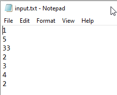

# Description
## Варіант 17
### Написати програму, яка сортує файл цілих чисел. Сортування виконувати за допомогою перезапису чисел вхідного файлу пря-мим методом доступу в інший файл.

# Samples
### 1) 

